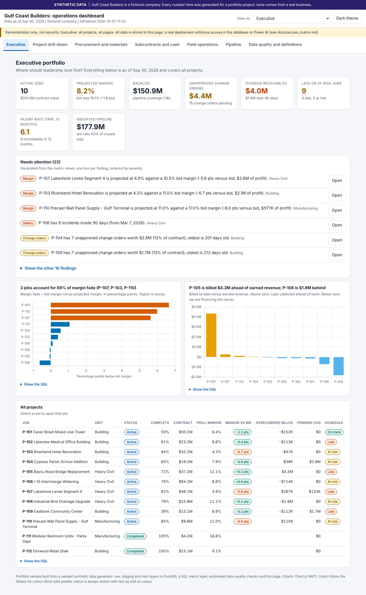
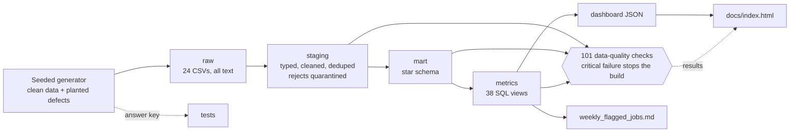
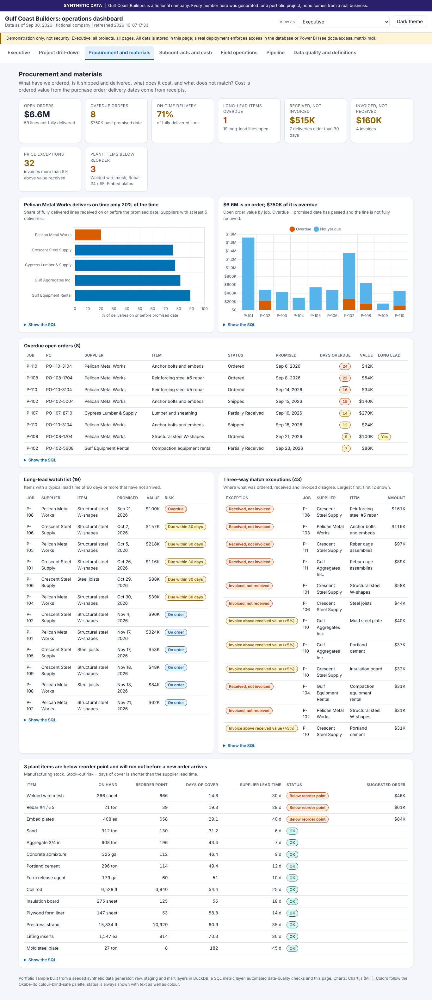
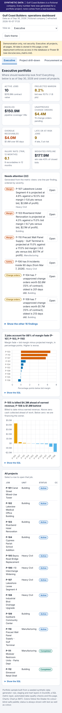
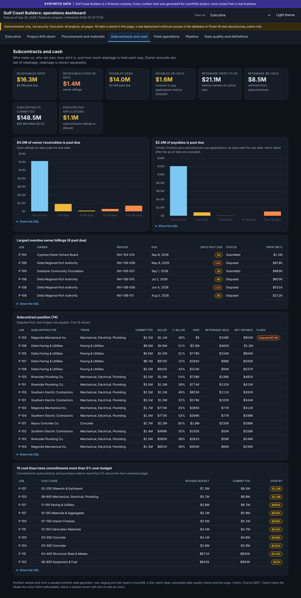

# Gulf Coast Builders: construction operations analytics

https://bbou122.github.io/GCoast/

> **SYNTHETIC DATA.** Gulf Coast Builders is a **fictional** contractor. Every row in this project was produced by a seeded random generator. Nothing here is real company data, nothing was taken from any real company's systems, and no real company's data, processes or software should be inferred from it.

An end-to-end analytics project for a construction firm, built to show how raw operational exports become numbers leadership can trust: **synthetic ERP and CRM data → DuckDB warehouse (raw / staging / mart) → automated data-quality checks → a SQL metric layer → a role-aware interactive dashboard → weekly flagged-jobs alerts.**



## What it answers

Eight core questions (margin fade, change-order exposure, billing position, backlog and pipeline, win rate, safety clusters, forecast credibility, data trust) plus seven operations questions (open and late purchase orders, three-way match, subcontract position, AP and AR aging, equipment utilization, plant inventory, RFIs and schedule). The full list with owners and metrics is in [`docs/business_questions.md`](docs/business_questions.md).

The dataset has **planted stories** with known answers, so the dashboard can be checked against the truth ([`docs/planted_findings.md`](docs/planted_findings.md)). For example: three jobs account for 88% of margin fade; two jobs carry about $4.3M of unapproved change orders; one job is billed $4.3M ahead of earned revenue; one job has a safety incident cluster; one supplier delivers on time only 20% of the time.

## Quick start

```bash
git clone <this repo> && cd gulf-coast-ops-analytics
python -m venv .venv && source .venv/bin/activate          # Windows: .venv\Scripts\activate
pip install -r requirements.txt
python run_all.py                                          # under 30 seconds without tests, about 80 seconds with
open docs/index.html                                       # or double-click it
```

`run_all.py` generates the data, builds the warehouse, runs the data-quality suite (a critical failure stops the run), runs the tests, exports the metrics, builds the dashboard and the weekly alert report, and regenerates the data dictionary. Options: `--regen` (force new synthetic data), `--skip-tests`. To also run the browser tests: `pip install -r requirements-dev.txt && python -m playwright install chromium`.

## Repository map

| Path | What it is |
|---|---|
| `src/generate_data.py`, `src/generate_erp_extension.py` | Seeded generator: clean data first, then **planted defects**; writes the answer key and defect log to `data/truth/` |
| `sql/01_raw.sql` ... `05_metrics.sql` | Raw load, staging (typing, cleaning, quarantine), marts (star schema), data-quality checks, metric views |
| `src/build_warehouse.py`, `src/run_checks.py` | Run the SQL in order; run the checks and exit non-zero on a critical failure |
| `src/export_dashboard_data.py`, `src/build_dashboard.py`, `src/dashboard_template.html` | Metric views to JSON, then one self-contained `docs/index.html` (Chart.js inlined) |
| `src/weekly_alerts.py` | Writes `alerts/weekly_flagged_jobs.md` |
| `tests/` | Answer-key tests, negative (corruption) tests, independent pandas recompute, headless-browser dashboard tests |
| `.github/workflows/weekly-refresh.yml` | Optional weekly rebuild and commit |
| `docs/` | Everything below, plus `index.html`, the published dashboard |

## Architecture



## How it is checked

| Layer of assurance | What it proves |
|---|---|
| **101 SQL checks** (`sql/04_quality_checks.sql`) | Keys unique, references resolve, values in range, row counts and dollar totals reconcile raw to staging to mart to metrics; 19 informational findings report source problems and business exceptions |
| **Planted-defect tests** | Every planted defect is caught or fixed as logged and *nothing else* is rejected (92 rejects = 92 planted bad rows) |
| **Answer-key tests** | Warehouse totals and headline metrics equal the clean answer key to the cent; the planted stories are the top findings |
| **Negative tests** | 13 deliberate corruptions each make the build fail |
| **Independent recompute** | 21 headline numbers rebuilt in pandas straight from the raw CSVs, with separate cleaning logic, match the warehouse |
| **Dashboard tests** | No JS errors on any role and page; 27 numbers computed in the browser equal the SQL layer; role restrictions remove rows, pages and fields; no horizontal scroll at 390 px |

Results are written up in [`docs/verification_report.md`](docs/verification_report.md).

## The dashboard

Seven pages: Executive, Project drill-down, Procurement and materials, Subcontracts and cash, Field operations, Pipeline, Data quality and definitions. Every chart has a takeaway title that is computed from the data in view, a plain-language note, and a **Show the SQL** panel with the view that produced it. Light and dark themes, colour-blind-safe palette, status always carried by text as well as colour, readable on a phone.

The **View as** selector (Executive, Finance, Business Unit Lead, Project Manager) changes what the page shows. **It is a front-end demonstration, not security**: the data for every role is inside the one HTML file. [`docs/access_matrix.md`](docs/access_matrix.md) explains how real enforcement works in Power BI (row-level and object-level security) and Snowflake (roles, row access policies, masking, secure views).



| Phone | Dark theme |
|---|---|
|  |  |

## Publish on GitHub Pages

1. Push the repository to GitHub (the `data/raw` CSVs and the warehouse file are rebuilt by `run_all.py`, so they can stay out of version control; `docs/index.html` is self-contained and must be committed).
2. Repository **Settings → Pages → Build and deployment → Deploy from a branch**, branch `main`, folder `/docs`.
3. After a minute the dashboard is live at `https://<your-user>.github.io/<repo>/`. The synthetic-data banner is part of the page, so it travels with the link.
4. Optional: the weekly workflow rebuilds and commits `docs/index.html` and the alert report every Monday.

## Documentation

| Document | Purpose |
|---|---|
| [`docs/user_guide.md`](docs/user_guide.md) | How to read and use the dashboard |
| [`docs/runbook.md`](docs/runbook.md) | Running, refreshing, and what to do when a check fails |
| [`docs/business_questions.md`](docs/business_questions.md) | The decisions the project supports |
| [`docs/data_model.md`](docs/data_model.md), [`docs/data_dictionary.md`](docs/data_dictionary.md) | Layers and tables; generated column-level dictionary |
| [`docs/metric_definitions.md`](docs/metric_definitions.md) | Every metric in plain English, with example DAX |
| [`docs/access_matrix.md`](docs/access_matrix.md) | Roles, data classification, and real enforcement in Power BI and Snowflake |
| [`docs/planted_findings.md`](docs/planted_findings.md), [`docs/planted_defects.md`](docs/planted_defects.md) | The planted stories and the logged bad rows (the answer keys) |
| [`docs/verification_report.md`](docs/verification_report.md) | What was verified and how |
| [`docs/limitations.md`](docs/limitations.md) | What this project does not do |

## Moving to Snowflake or Power BI

The SQL uses portable constructs (CTEs, window functions) with `-- SNOWFLAKE:` comments where syntax differs (`read_csv` → `COPY INTO`, `regexp_matches` → `REGEXP_LIKE`, and so on). Each view in `metrics` maps to one DAX measure group; `docs/metric_definitions.md` includes starter DAX. A production version would replace the CSV generator with real extracts, keep the staging rules and checks, and add the access controls in `docs/access_matrix.md`.

## Tested with

Python 3.13 with DuckDB 1.5 / pandas 3.0 / numpy 2.5, and again from a clean checkout with DuckDB 1.1.3 / pandas 2.2.3 / numpy 2.1.3 (identical results); Chart.js 4.4.1 (MIT, vendored in `vendor/`), Chromium via Playwright. The seed is fixed (`20260930`), so every run produces identical data.
