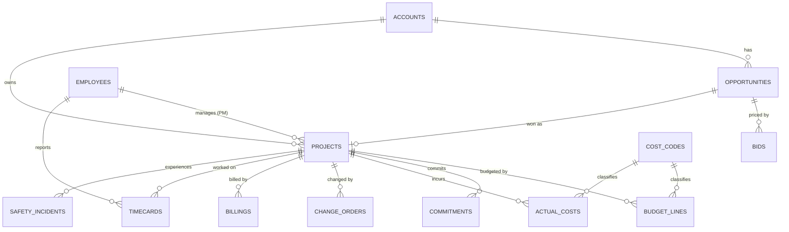
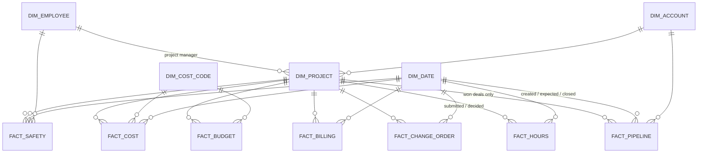

# Data model

> **Synthetic data.** Gulf Coast Builders is fictional. The "ERP" and "CRM" below are simulated source systems generated by `src/generate_data.py`; they imitate the *shape* of construction ERP and CRM exports, not any real vendor's schema.

## Layers

| Layer | Schema | What it holds | Rules |
|---|---|---|---|
| **raw** | `raw` | Simulated source-system exports, loaded as text exactly as delivered (all `VARCHAR`). Deliberately imperfect. | Never edited. Includes the planted defects. |
| **staging** | `stg` | Cleaned and typed copies of every raw table, plus `rejects` and `vendor_map`. | Fix what is safely fixable, deduplicate, quarantine the rest with a reason code. Nothing is silently dropped. |
| **mart** | `mart` | Star schema for reporting: dimensions and facts with surrogate keys. | Only staging rows reach the marts. Metric views (`sql/05_metrics.sql`) sit on top of the marts. |

Failures can be traced to a single layer: if raw row counts are wrong the extract is at fault, if staging rejects spike a source rule changed, and if a mart number is wrong the transformation logic is at fault.

Business units are `Building`, `Heavy Civil` and `Manufacturing`. Every project has exactly one.

## Source systems (raw layer)

**ERP** (10 tables): `projects`, `cost_codes`, `budget_lines`, `commitments`, `actual_costs`, `change_orders`, `billings`, `timecards`, `employees`, `safety_incidents`.
**CRM** (3 tables): `accounts`, `opportunities`, `bids`.

### Source table definitions

Grain is stated first; every raw column is text and is typed in staging.

**`projects`** (one row per project). `project_id` (PK, `P-###`), `project_name`, `business_unit`, `account_id` (FK accounts), `pm_employee_id` (FK employees), `start_date`, `planned_end_date`, `original_contract_value` (bid price at award), `status` (`Active`/`Completed`), `opportunity_id` (FK opportunities; the CRM deal that was won).

**`cost_codes`** (one row per code). `cost_code` (PK, `NN-NNN`), `cost_code_name`, `category` (Labor, Material, Subcontract, Equipment, Indirect), `division`.

**`budget_lines`** (project x cost code). `budget_line_id` (PK), `project_id` (FK), `cost_code` (FK), `original_budget` (bid cost), `approved_co_budget` (cost added by approved change orders), `revised_budget` (sum of the two), `estimate_to_complete` (PM's estimate of remaining cost at the as-of date), `etc_updated_date`.

**`commitments`** (one row per subcontract or PO). `commitment_id` (PK), `project_id`, `cost_code`, `vendor_name` (free text; spelling varies), `commitment_type` (`Subcontract`/`Purchase Order`), `original_amount`, `approved_changes`, `status`, `executed_date`.

**`actual_costs`** (project x cost code x month, one row per posting). `cost_id` (PK), `project_id` (FK), `cost_code` (FK), `period` (month end), `amount` (can be negative only for credit memos), `vendor_name` (blank for payroll), `source_system` (`AP`/`Payroll`/`Equipment`), `description`.

**`change_orders`** (one row per change order). `change_order_id` (PK), `project_id` (FK), `co_number`, `description`, `reason`, `submitted_date`, `decision_date` (blank while pending), `status` (`Approved`/`Pending`/`Rejected`), `amount` (revenue the owner would pay), `estimated_cost` (our cost to perform).

**`billings`** (one row per pay application). `billing_id` (PK), `project_id` (FK), `pay_app_no`, `period_end`, `invoice_no`, `gross_billed` (this period, before retainage), `retainage_held`, `status` (`Draft`/`Submitted`/`Paid`), `submitted_date`.

**`timecards`** (employee x week). `timecard_id` (PK), `employee_id` (FK), `project_id` (FK), `week_ending` (Saturday), `regular_hours`, `overtime_hours`. Used to supply hours worked for safety rates.

**`employees`** (one row per person; names are invented). `employee_id` (PK), `full_name`, `role`, `business_unit`, `is_field`, `hire_date`, `hourly_rate` (Confidential), `email` (synthetic `@example.invalid`).

**`safety_incidents`** (one row per incident). `incident_id` (PK), `project_id` (FK), `incident_date`, `incident_type` (`Near Miss`/`First Aid`/`Recordable`/`Lost Time`), `cause_category`, `employee_id` (FK, may be blank), `recordable_flag` (`Y` for Recordable and Lost Time), `days_away`, `severity` (1 to 4), `description`.

**`accounts`** (CRM customers). `account_id` (PK), `account_name`, `segment`, `region`, `created_date`.

**`opportunities`** (CRM deals). `opportunity_id` (PK), `account_id` (FK), `opportunity_name`, `business_unit`, `stage` (`Lead`, `Qualified`, `Proposal`, `Negotiation`, `Won`, `Lost`), `amount`, `probability` (0 to 1; stage default with noise), `created_date`, `expected_close_date`, `closed_date`, `owner`, `lead_source`.

**`bids`** (one row per priced bid). `bid_id` (PK), `opportunity_id` (FK), `bid_date`, `bid_amount`, `estimated_cost`, `bid_margin_pct`, `competitor_count`, `result` (`Won`/`Lost`/`Pending`), `loss_reason`.

## Staging layer (`stg`)

One `stg_<table>` per raw table with proper types (`DATE`, `DECIMAL(18,2)`, `INTEGER`) and these standard rules (full list in `docs/planted_defects.md`):

| Rule | Applies to | Action |
|---|---|---|
| Parse dates in `YYYY-MM-DD` or `MM/DD/YYYY` | actual_costs, billings | fix |
| Strip `$` and `,` from amounts | actual_costs | fix |
| Normalise cost code to `NN-NNN` | actual_costs | fix |
| Standardise vendor names via `vendor_map` (case, punctuation, `&`/`and`, legal suffix) | actual_costs, commitments | fix |
| Standardise stage labels | opportunities | fix |
| Deduplicate on (`project_id`, `invoice_no`), keep earliest `billing_id` | billings | dedupe |
| Reject blank cost code, unknown project/employee/account/opportunity, future period, hours above 80, negative amount without credit-memo wording | all | quarantine to `rejects` |

`rejects(source_table, source_key, reject_reason, raw_row_json, rejected_at)` holds every quarantined row with a reason, so each rejected row can be audited and replayed.

## Mart layer (`mart`): star schema

The ten marts requested are `dim_project`, `dim_date`, `dim_cost_code`, `dim_employee`, `dim_account`, `fact_cost`, `fact_billing`, `fact_change_order`, `fact_pipeline` and `fact_safety`. Two small additions are needed to answer the business questions: **`fact_budget`** (budget and estimate to complete live at project x cost code, not by month, so they cannot sit in `fact_cost` without double counting) and **`fact_hours`** (hours worked, the denominator for incident rates). Commitments stay in staging only, because no business question needs them yet.

### Dimensions

| Table | Grain | Columns |
|---|---|---|
| `dim_project` | 1 per project | `project_key` (surrogate), `project_id`, `project_name`, `business_unit`, `account_key`, `pm_employee_key`, `start_date`, `planned_end_date`, `status`, `original_contract_value`, `original_budget_cost`, `original_margin_pct` (= (contract - budget cost) / contract), `opportunity_id` |
| `dim_date` | 1 per calendar day, 2024-10-01 to 2028-12-31 | `date_key` (`YYYYMMDD` int), `date`, `year`, `quarter`, `month`, `month_name`, `year_month`, `week_ending` (Saturday), `is_month_end`, `is_past_as_of` |
| `dim_cost_code` | 1 per cost code | `cost_code_key`, `cost_code`, `cost_code_name`, `category`, `division` |
| `dim_employee` | 1 per employee | `employee_key`, `employee_id`, `full_name`, `role`, `business_unit`, `is_field`, `hire_date`. `hourly_rate` and `email` are **not** carried into the mart (Confidential, not needed by any question). |
| `dim_account` | 1 per customer | `account_key`, `account_id`, `account_name`, `segment`, `region` |

### Facts

| Table | Grain | Keys | Measures / attributes |
|---|---|---|---|
| `fact_cost` | 1 per cleaned cost posting | `project_key`, `cost_code_key`, `date_key` (period end) | `cost_id` (degenerate), `actual_cost`, `vendor_std`, `source_system` |
| `fact_budget` | 1 per project x cost code | `project_key`, `cost_code_key` | `original_budget`, `approved_co_budget`, `revised_budget`, `estimate_to_complete` |
| `fact_billing` | 1 per pay application | `project_key`, `date_key` (period end) | `invoice_no`, `pay_app_no`, `gross_billed`, `retainage_held`, `net_billed`, `status` |
| `fact_change_order` | 1 per change order | `project_key`, `submitted_date_key`, `decision_date_key` | `change_order_id`, `status`, `amount`, `estimated_cost`, `reason`, `age_days` (as-of minus submitted, pending only) |
| `fact_pipeline` | 1 per CRM opportunity | `account_key`, `project_key` (won only), `created_date_key`, `expected_close_date_key`, `closed_date_key` | `opportunity_id`, `business_unit`, `stage`, `amount`, `probability`, `weighted_amount`, `is_open`, `is_won`, `is_lost`, `is_awarded_unstarted`, `bid_amount`, `bid_margin_pct` |
| `fact_safety` | 1 per incident | `project_key`, `date_key`, `employee_key` | `incident_id`, `incident_type`, `cause_category`, `severity`, `recordable_flag`, `days_away` |
| `fact_hours` | 1 per project x week | `project_key`, `date_key` (week ending) | `hours` (regular + overtime), `worker_count` |

## ERP expansion: procurement, subcontract pay, field operations

> Added in checkpoint 2B. Every table follows the same raw -> staging -> mart path, with its own planted defects, reject rules and quality checks.

| Raw table | Grain | Staging notes | Mart table |
|---|---|---|---|
| `vendors` | 1 per supplier or subcontractor | Master for vendor-name standardisation (`stg.vendor_map`) | `dim_vendor` |
| `purchase_orders` | 1 per PO line | Vendor spelling fixed, mixed date formats parsed; exact duplicates, orphan projects, non-positive quantities and received-before-ordered rows quarantined | `fact_purchase_order` |
| `po_receipts` | 1 per delivery receipt | Duplicates and receipts for unknown PO lines quarantined | `fact_receipt` |
| `ap_invoices` | 1 per vendor invoice | Currency text parsed; re-keyed duplicates (same vendor and invoice number), orphan PO lines and future-dated invoices quarantined | `fact_ap_invoice` |
| `commitments` | 1 per subcontract or PO commitment | Vendor standardised | `fact_commitment` (billed, paid and retainage rolled up from pay applications) |
| `subcontract_pay_apps` | 1 per subcontractor pay application | Orphan commitments and negative gross amounts quarantined | `fact_sub_pay_app` |
| `equipment`, `equipment_usage` | unit; unit x project x month | Impossible day counts (over 31) and unknown units quarantined | `dim_equipment`, `fact_equipment_usage` |
| `inventory_items` | 1 per stocked item (snapshot) | Negative stock on hand quarantined | `fact_inventory` |
| `rfis`, `submittals` | 1 per request | Responses dated before submission and unknown projects quarantined | `fact_rfi`, `fact_submittal` |
| `schedule_milestones` | 1 per milestone | Duplicates quarantined | `fact_milestone` |

**Keys that tie the new tables together:** `purchase_orders.commitment_id` links a PO line to its commitment; `po_receipts.po_line_id` and `ap_invoices.po_line_id` link deliveries and invoices to the line (the three-way match); `subcontract_pay_apps.commitment_id` links pay applications to the subcontract; `vendor_name` is standardised against the vendor master in every table that carries it.

**Counts after cleaning:** 16 vendors, 18 equipment units, 134 commitments, 505 PO lines, 494 receipts, 481 vendor invoices, 367 subcontractor pay applications, 357 equipment-usage rows, 14 inventory items, 206 RFIs, 294 submittals, 72 milestones. 92 rows across all tables are quarantined in `stg.rejects` (every one matches a planted defect).

**New metric views (schema `metrics`):** `v_po_line_status`, `v_vendor_scorecard`, `v_long_lead_watch`, `v_three_way_match_exceptions`, `v_project_procurement`, `v_commitment_vs_budget`, `v_subcontract_position`, `v_ap_open_items`, `v_ar_open_items`, `v_aging_summary`, `v_retainage_position`, `v_equipment_by_unit`, `v_equipment_by_project`, `v_inventory_status`, `v_rfi_by_project`, `v_rfi_open_detail`, `v_submittal_by_project`, `v_schedule_by_project`, `v_project_schedule_variance`, `v_milestone_detail`.

## Conventions

- **Surrogate keys** are integers assigned in the mart build; natural keys (`project_id`, etc.) are retained for traceability.
- **As-of date:** `2026-09-30`, stored once in `etl_params` and used by every view so that results are reproducible. In a live warehouse this would be `CURRENT_DATE`.
- **Money** is `DECIMAL(18,2)` in US dollars. **Margin** is a ratio stored as a decimal (0.095 = 9.5%).
- **Portability:** SQL is written with CTEs and window functions only. Where Snowflake differs from DuckDB (for example `read_csv`, `try_strptime`, `QUALIFY`, `GENERATE_SERIES`) a `-- SNOWFLAKE:` comment shows the equivalent.

## Data classification

Table-level classification (Public, Internal, Confidential) and the role matrix are in `docs/access_matrix.md`.
